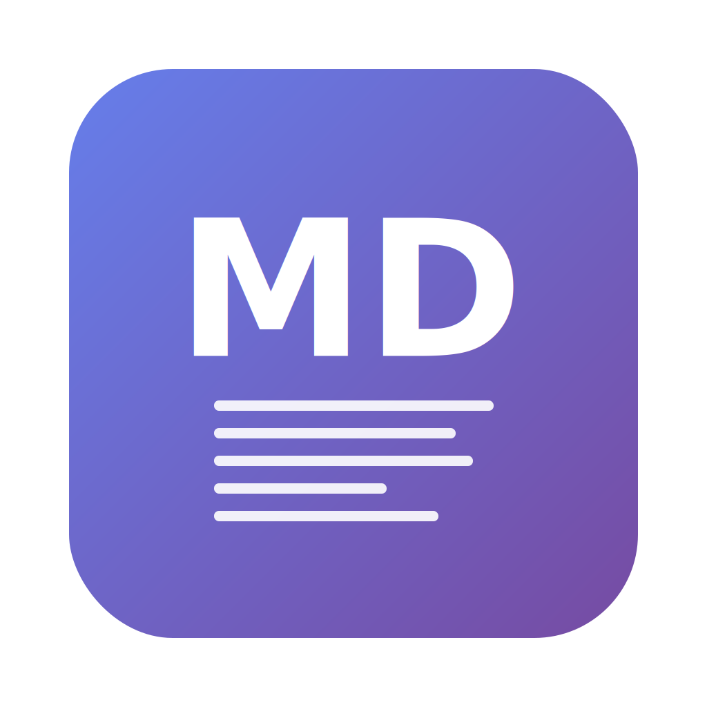

# Markdown Reader

A feature-rich, professional markdown document reader built with Electron. This application provides a GitHub-style markdown rendering experience with advanced navigation, search capabilities, and comprehensive tab management.



## ✨ Features

### 🗂️ Multi-Tab Interface
- **Intuitive Tab Management**: Open multiple markdown files simultaneously with a clean, Chrome-like tab interface
- **Drag & Drop Reordering**: Rearrange tabs by dragging them to your preferred order with visual feedback
- **Smart Welcome Tab**: Clean welcome screen that shows recent files and provides quick access to file operations
- **File Icons & Tooltips**: Each tab displays a file icon with the full file path shown on hover
- **Quick Path Copying**: Click any tab's file icon to instantly copy the file path to your clipboard
- **Dynamic Window Titles**: Window title updates to show the active file name

### 🔍 Search System
- **Document Search**: Search through document content with keyboard shortcuts
- **Table of Contents Navigation**: Navigate through document sections via auto-generated TOC
- **Keyboard Navigation**: Use keyboard shortcuts to access search functionality

### 📑 Table of Contents
- **Auto-Generated TOC**: Automatically generates navigation from markdown headings
- **Toggle Visibility**: Show/hide table of contents via View menu
- **Section Navigation**: Click headings to jump to document sections

### 🎨 Theming & Display
- **Dual Theme Support**: Light and dark themes with manual switching
- **Settings Persistence**: Theme preferences saved automatically across sessions
- **Markdown Rendering**: Clean, readable typography for markdown content
- **Code Highlighting**: Syntax highlighting for code blocks

### 📁 File Management
- **Multi-Window Support**: Create additional windows with `Cmd+Shift+N` / `Ctrl+Shift+N` for multi-project workflows
- **Independent Window States**: Each window maintains its own tabs, recent files, and application state
- **Recent Files**: Quick access to recently opened files via File menu and welcome screen
- **Live File Watching**: Documents automatically refresh when changed externally
- **Multiple Opening Methods**: File menu, drag & drop, or command line arguments
- **Path Display**: Full file paths shown in tooltips and copyable via tab icons

### 🗂️ Window Management
- **Window Menu**: Dynamic list of open tabs with `Cmd+1` through `Cmd+9` shortcuts for quick switching
- **Close All Tabs**: `Cmd+Shift+W` creates a fresh window at the same position and size
- **Tab Switching**: Quick navigation between tabs using keyboard shortcuts
- **Window Position Preservation**: Close All Tabs maintains window size and position

### ⚡ Core Functionality
- **Fast Rendering**: Efficient markdown parsing and HTML generation
- **Tab State Management**: Each tab maintains its own scroll position and content state
- **Keyboard Shortcuts**: Essential keyboard support for common operations
- **Cross-Platform**: Works on macOS, Windows, and Linux
- **Offline Ready**: All dependencies bundled for offline functionality

## 📖 Usage

### Opening Files
1. **File Menu**: Use File > Open File(s)... or `Cmd+O` / `Ctrl+O`
2. **Drag & Drop**: Drop markdown files onto the application window
3. **Recent Files**: Access recently opened files via File > Recent Files
4. **Command Line**: Pass file path as argument when launching from terminal

### Tab Management
- **New Tabs**: Create new tabs with `Cmd/Ctrl+N` or the + button
- **New Windows**: Create additional windows with `Cmd/Ctrl+Shift+N` for multi-project workflows
- **File Loading**: Files open in new tabs automatically
- **Tab Navigation**: Click tabs to switch between documents
- **Tab Reordering**: Drag tabs to rearrange them
- **Tab Closing**: Click the × button on tabs to close them
- **File Path Copying**: Click the file icon on any tab to copy its path

### Window Menu Features
- **Tab List**: Window menu shows all open tabs with numbered shortcuts
- **Quick Switching**: Use `Cmd+1` through `Cmd+9` to switch to specific tabs
- **Close All Tabs**: Use Window > Close All Tabs or `Cmd+Shift+W` to reset the workspace

### Keyboard Shortcuts
| Shortcut | Action |
|----------|---------|
| `Cmd/Ctrl+N` | Create new tab |
| `Cmd/Ctrl+Shift+N` | Create new window |
| `Cmd/Ctrl+O` | Open file(s) |
| `Cmd/Ctrl+1-9` | Switch to tab 1-9 |
| `Cmd/Ctrl+Shift+W` | Close all tabs (creates fresh window) |
| `Cmd/Ctrl+T` | Toggle table of contents |
| `Cmd/Ctrl+F` | Open search |
| `Cmd/Ctrl+C` | Copy selected text |
| `Cmd/Ctrl+Shift+C` | Copy all document content |
| `Cmd/Ctrl+D` | Toggle light/dark theme |
| `Cmd/Ctrl+,` | Open preferences |

### Search & Navigation
- Use `Cmd/Ctrl+F` to search within documents
- Table of contents automatically generated from headings
- Click TOC items to jump to sections
- Use `Cmd/Ctrl+T` to toggle TOC visibility
| `Cmd/Ctrl+T` | Toggle table of contents |
| `Cmd/Ctrl+F` | Open search |
| `Cmd/Ctrl+C` | Copy selected text |
| `Cmd/Ctrl+Shift+C` | Copy all document content |
| `Cmd/Ctrl+D` | Toggle light/dark theme |
| `Cmd/Ctrl+,` | Open preferences |

### Search & Navigation
- Use `Cmd/Ctrl+F` to search within documents
- Table of contents automatically generated from headings
- Click TOC items to jump to sections
- Use `Cmd/Ctrl+T` to toggle TOC visibility

## 🚀 Installation

### Download
- Download the latest release from the GitHub releases page
- Available for macOS, Windows, and Linux

### From Source
```bash
# Clone the repository
git clone https://github.com/yourusername/electron-markdown-reader.git
cd electron-markdown-reader

# Install dependencies
npm install

# Run the application
npm start

# Build for production
npm run build
```

## 🛠️ Development

### Prerequisites
- Node.js 16+ 
- npm 7+

### Setup
```bash
# Install dependencies
npm install

# Run in development mode
npm run dev

# Run tests
npm test

# Build for distribution
npm run build
```

### Testing
This project includes comprehensive tests:
```bash
# Run all tests
npm test

# Run with coverage
npm run test:coverage

# Run specific test suites
npm run test -- --testNamePattern="Tab"
```

## 🏗️ Architecture

### Technology Stack
- **Electron 33.0.0**: Desktop application framework
- **Node.js**: Runtime environment
- **Marked.js**: Markdown parsing
- **Prism.js**: Syntax highlighting for code blocks
- **Lucide Icons**: Modern icon library
- **Jest**: Testing framework

### File Structure
```
electron-markdown-reader/
├── main.js              # Main Electron process
├── preload.js           # Preload script for secure IPC
├── renderer/            # Renderer process files
│   ├── index.html       # Main application window
│   ├── renderer.js      # Application logic
│   └── styles.css       # Application styling
├── tests/               # Test suites
└── package.json         # Dependencies and scripts
```

## 📄 License

MIT License - see the [LICENSE](LICENSE) file for details.

## 🤝 Contributing

Contributions are welcome! Please feel free to submit a Pull Request.
